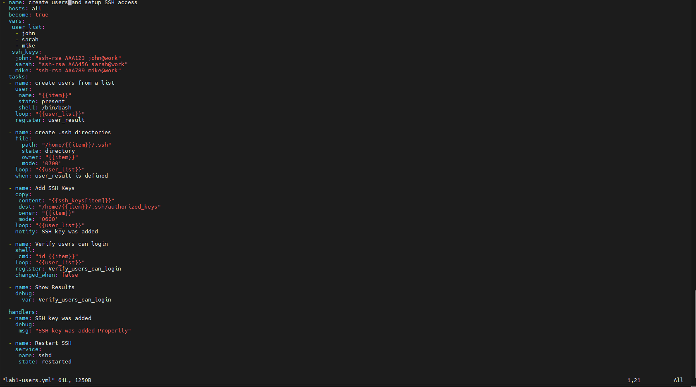
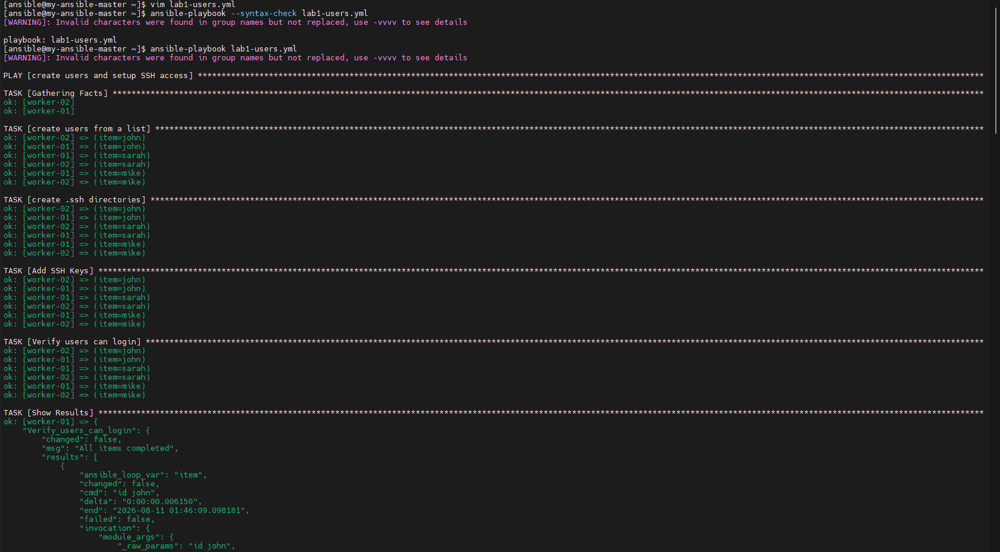
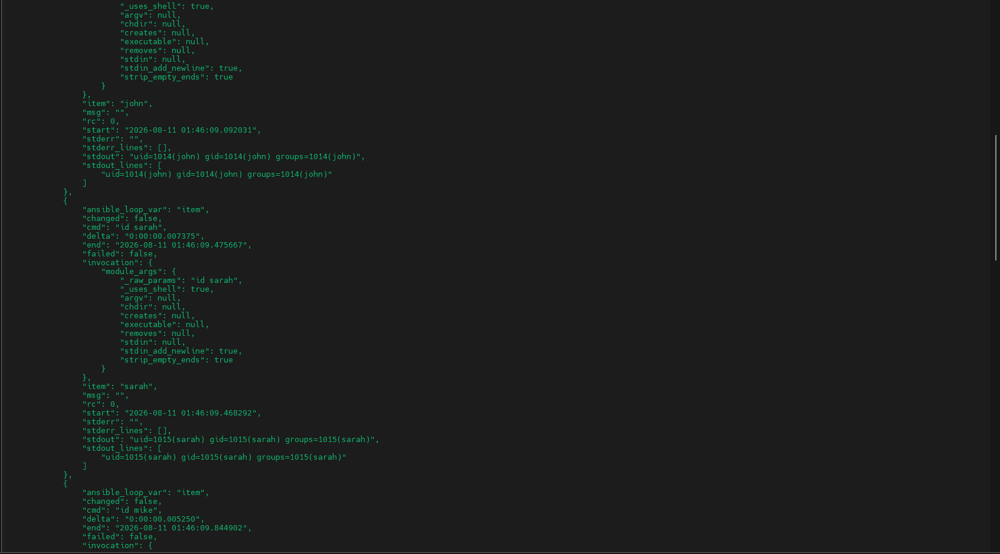
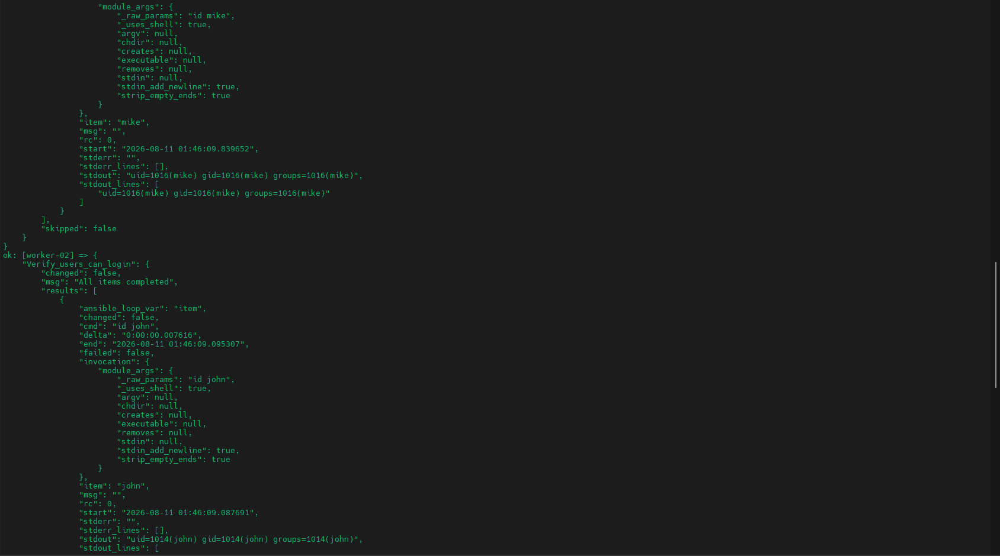
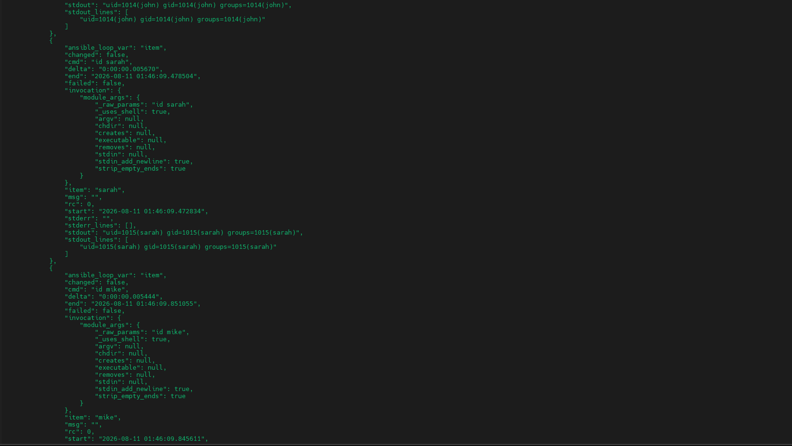
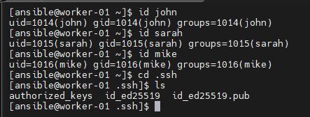
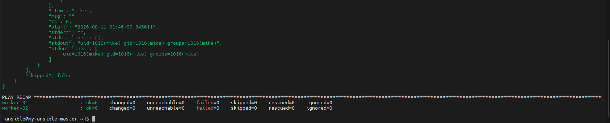

# Ansible User & SSH Provisioning Playbook

An Ansible playbook that creates a set of Linux users across multiple managed nodes, sets up their `.ssh` directories, installs SSH keys, verifies login, and restarts SSH via a handler — a DEPI DevOps Track task.

**Concepts used:** `vars`, `loop`, `handlers`, `register`

---

## 📋 Task Overview

Create a playbook called `lab1-users.yml` that performs the following:

**Task 1 — Create users from a list**
- Module: `user`
- Parameters: `name`, `state: present`, `shell: /bin/bash`
- Creates 3 users: `john`, `sarah`, `mike`
- Uses a `loop` over the user list
- Registers the result in `user_result`

**Task 2 — Create `.ssh` directories**
- Module: `file`
- Parameters: `path`, `state: directory`, `owner`, `mode: '0700'`
- Creates `/home/john/.ssh`, `/home/sarah/.ssh`, `/home/mike/.ssh`
- Uses a `loop`
- Uses a `when` condition so it only runs if the user was created

**Task 3 — Add SSH keys**
- Module: `copy`
- Parameters: `content`, `dest`, `owner`, `mode: '0600'`
- Adds a simple SSH key per user from the `ssh_keys` dictionary
- Uses a `loop` with a variables list
- Notifies the `SSH key was added` handler

**Task 4 — Verify users can login**
- Module: `shell`
- Command: `id <user>` for each user
- Registers the output in `Verify_users_can_login`
- Uses `changed_when: false` (read-only check, never reports "changed")

**Task 5 — Show results**
- Module: `debug`
- Displays the registered output from Task 4

**Task 6 — Handler**
- Name: `Restart SSH`
- Module: `service`
- Parameters: `name: sshd`, `state: restarted`

**Variables defined:**
```yaml
user_list:
  - john
  - sarah
  - mike
ssh_keys:
  john: "ssh-rsa AAA123 john@work"
  sarah: "ssh-rsa AAA456 sarah@work"
  mike: "ssh-rsa AAA789 mike@work"
```

---

## 📜 Playbook Code — `lab1-users.yml`



```yaml
- name: create users and setup SSH access
  hosts: all
  become: true
  vars:
    user_list:
      - john
      - sarah
      - mike
    ssh_keys:
      john: "ssh-rsa AAA123 john@work"
      sarah: "ssh-rsa AAA456 sarah@work"
      mike: "ssh-rsa AAA789 mike@work"

  tasks:
    - name: create users from a list
      user:
        name: "{{item}}"
        state: present
        shell: /bin/bash
      loop: "{{user_list}}"
      register: user_result

    - name: create .ssh directories
      file:
        path: "/home/{{item}}/.ssh"
        state: directory
        owner: "{{item}}"
        mode: '0700'
      loop: "{{user_list}}"
      when: user_result is defined

    - name: Add SSH Keys
      copy:
        content: "{{ssh_keys[item]}}"
        dest: "/home/{{item}}/.ssh/authorized_keys"
        owner: "{{item}}"
        mode: '0600'
      loop: "{{user_list}}"
      notify: SSH key was added

    - name: Verify users can login
      shell:
        cmd: "id {{item}}"
      loop: "{{user_list}}"
      register: Verify_users_can_login
      changed_when: false

    - name: Show Results
      debug:
        var: Verify_users_can_login

  handlers:
    - name: SSH key was added
      debug:
        msg: "SSH key was added Properlly"

    - name: Restart SSH
      service:
        name: sshd
        state: restarted
```

---

## ▶️ Running the Playbook

Syntax-check first, then run:

```bash
ansible-playbook --syntax-check lab1-users.yml
ansible-playbook lab1-users.yml
```



Each task runs across both workers (`worker-01`, `worker-02`) and loops through all three users (`john`, `sarah`, `mike`):

- `Gathering Facts` — ok on both hosts
- `create users from a list` — ok for john/sarah/mike on both hosts
- `create .ssh directories` — ok for john/sarah/mike on both hosts
- `Add SSH Keys` — ok for john/sarah/mike on both hosts (triggers the `SSH key was added` handler)
- `Verify users can login` — runs `id <user>` on both hosts, `changed: false` as expected
- `Show Results` — dumps the registered `Verify_users_can_login` output





---

## ✅ Verification

Manually checking that the users were created with correct UID/GID and that each has a proper `.ssh` directory with keys:

```bash
id john
id sarah
id mike
cd .ssh
ls
# authorized_keys  id_ed25519  id_ed25519.pub
```



---

## 🏁 Play Recap

```
PLAY RECAP *********************************************************
worker-01  : ok=6  changed=0  unreachable=0  failed=0  skipped=0  rescued=0  ignored=0
worker-02  : ok=6  changed=0  unreachable=0  failed=0  skipped=0  rescued=0  ignored=0
```

All 6 tasks completed successfully (`ok=6`) on both workers with zero failures.



---

## 📂 Repository Structure

```
.
├── README.md
├── lab1-users.yml
└── images/
    ├── 01-lab1-users-playbook-code.png
    ├── 02-verify-users-and-ssh-id.png
    ├── 03-playbook-run-output-part1.png
    ├── 04-playbook-run-output-part2.png
    ├── 05-playbook-run-output-part3.png
    ├── 06-playbook-run-output-part4.png
    └── 07-play-recap-validation.png
```

---

## 🛠️ Tools & Technologies

- Ansible (`user`, `file`, `copy`, `shell`, `debug`, `service` modules)
- `vars`, `loop`, `register`, `when`, `handlers`
- Linux user & SSH key management

---

## 📝 Notes

- `become: true` is set at the play level since creating users and writing into `/home/*` requires root privileges.
- `changed_when: false` on the verification task keeps the `id` command from ever being reported as a change — it's a pure read.
- The `SSH key was added` handler only fires because the `Add SSH Keys` task notifies it; it won't run if the `copy` task reports no change.
